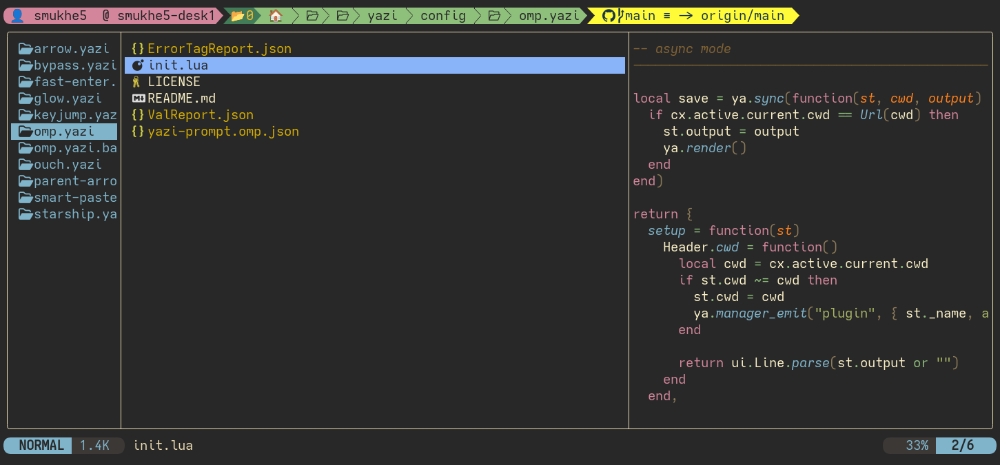

# omp.yazi

oh-my-posh prompt plugin for [Yazi](https://github.com/sxyazi/yazi) file manager.



## Requirements

- [Yazi](https://github.com/sxyazi/yazi) Need latest main branch code, Needs the latest commit. Or use [v 0.4.0](https://github.com/sxyazi/yazi/releases/tag/v0.4.0) release or newer.
    Please use below command to install.
```cmd
  cargo install --locked --git https://github.com/sxyazi/yazi.git yazi-fm yazi-cli
```
Or if you're on an arch based distro, you can use your fav AUR helper.
```cmd
  paru yazi-git
```


## Installation

### Linux / MacOS

```sh
git clone https://github.com/saumyajyoti/omp.yazi.git ~/.config/yazi/plugins/omp.yazi
```

### Windows

```sh
git clone https://github.com/saumyajyoti/omp.yazi.git %AppData%\yazi\config\plugins\omp.yazi
```

## Usage

Add this to `~/.config/yazi/init.lua`:

```lua
require("omp"):setup()
```

If you want to define a custom config file, you can specify `config` argument for setup like this:

```lua
require("omp"):setup({ config = "/home/user/.config/omp.json" })
```

Make sure you have https://github.com/jandedobbeleer/oh-my-posh installed and in your `PATH`.

## Extra

If you use a `oh-my-posh` theme with a background colour, it might look a bit to cramped on just the one line `Yazi` gives the header by default. You can add some space for the header using the Fullborder plugin.
```
ya pack -a yazi-rs/plugins#full-border
```

## Acknowledgements

- [sxyazi](https://github.com/sxyazi) for providing the code for this plugin.
